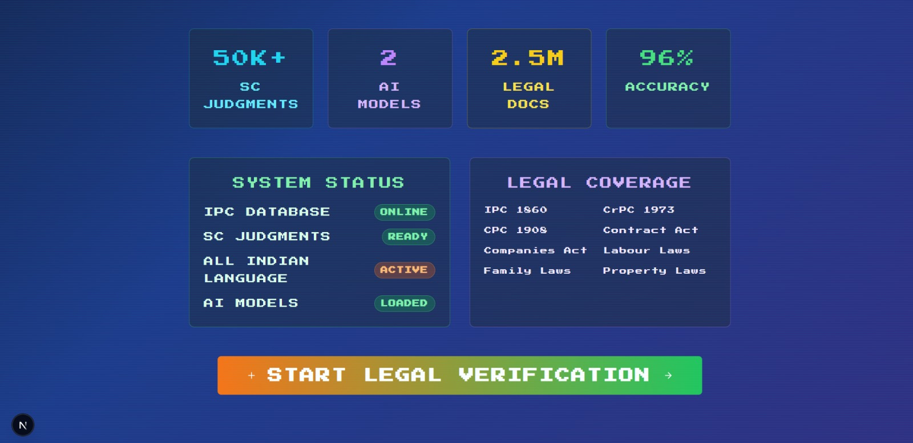
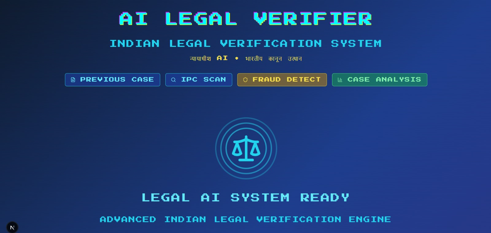
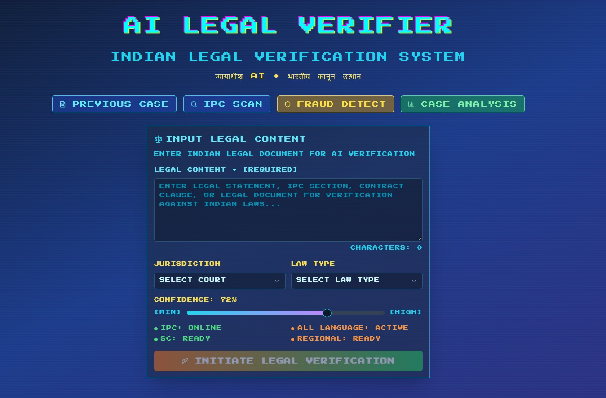
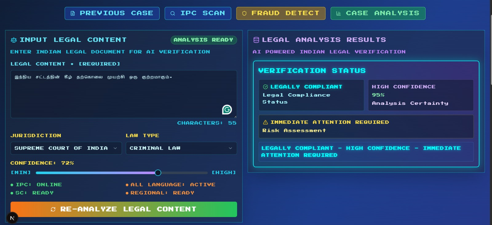
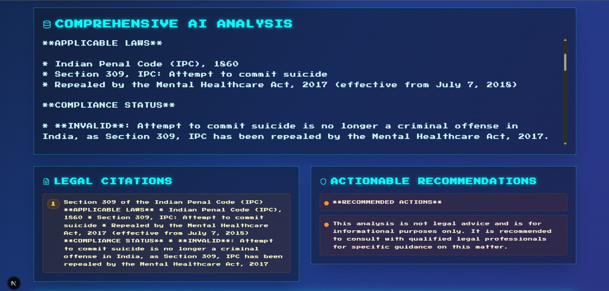
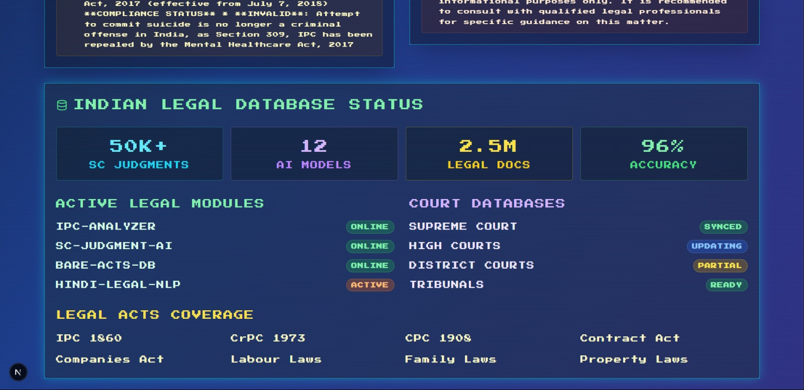

# ⚖️ AI Legal Verifier

An AI-powered system that verifies legal content by matching it with authentic Indian laws, Bare Acts, constitutional provisions, and judgments. This tool helps users validate AI-generated or human-drafted legal content with real legal sources, ensuring **transparency**, **jurisdictional accuracy**, and **legal authenticity**.

---

## 🚀 Features

- ✅ Semantic verification of legal statements using NLP
- 🔍 Match content against Bare Acts, Judgments, and Articles
- ⚖️ Indian jurisdiction-focused verification
- 📊 Confidence scoring for retrieved matches
- 🧠 Uses OpenAI / Groq APIs for language understanding
- 🌐 Pixel-themed React-based UI

---

## 🧱 Tech Stack

| Layer       | Technology                       |
|-------------|----------------------------------|
| Frontend    | React + Vite (Pixel UI)         |
| APIs Used   | OpenAI API, Groq API             |
| Styling     | Tailwind CSS                     |
| Search Logic| Embeddings + vector matching     |
| Deployment  | Vercel / Netlify (suggested)     |

---
```bash
## 📂 Project Structure

AI-Legal-Verifier/
├── public/ # Static assets 
├── src/
│ ├── components/ # React components (UI)
│ ├── hooks/ # Custom React hooks
│ ├── utils/ # API, embeddings, helpers
│ ├── App.tsx / index.tsx
│ └── styles/ # Tailwind or CSS modules
│
├── .env.local # API keys (not committed)
├── package.json # Project metadata
└── README.md # Documentation

```
---

## ⚙️ How to Run Locally

### 1. Clone the repository
```bash
git clone https://github.com/vira250/AI-Legal-Verifier.git
cd AI-Legal-Verifier
```

### 2. Create .env.local

# .env.local
```bash
VITE_OPENAI_API_KEY=sk-XXXXXXXXXXXXXXXXXXXXXXXX
VITE_GROQ_API_KEY=groq-XXXXXXXXXXXXXXXXXXXXXXXX
```
### 3. Install dependencies

```bash 
npm install react react-dom vite axios lucide-react framer-motion classnames tailwindcss postcss autoprefixer
```
### 4. Run the App

```bash
npm run dev
```

## 💡 Use Cases

Law Students & Professionals

Legal AI Tool Builders

Legal Education Platforms

## 📸 Screenshots

<p align="center">
  
  
  
</p>

<p align="center">
  
  
  
</p>

## 🛠 Future Improvements

PDF/Document Upload & Parsing

Judgment Date Filtering

Local vector search indexing